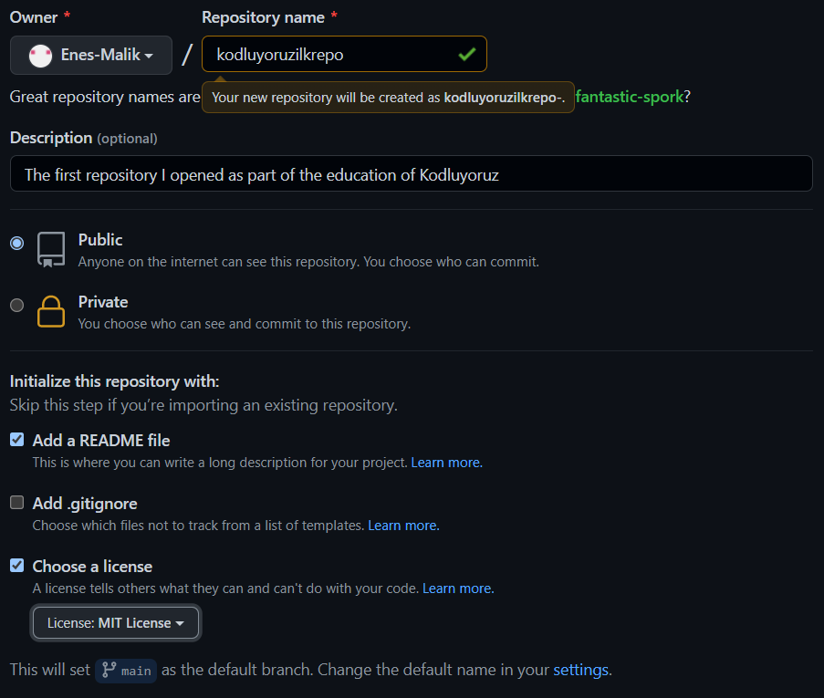

# Kodluyoruz Ilk
The first repository I opened as part of the education of <u>[Kodluyoruz](#)</u>. It holds a README file and an index.html file.


## Instalation
Firstly clone the project. (There should be the link of your repository)

``` 
https://github.com/Enes-Malik/kodluyoruzilkrepo.git 
```

## Usage
After clone the project, open  VS Code.

For Windows:
``` 
cd kodluyoruzilkrepo
code . 
```

## Contributing
Pull requests are accepted. For big changes, please open a topic you want to discuss .

## License

<u>[MIT](#)</u>